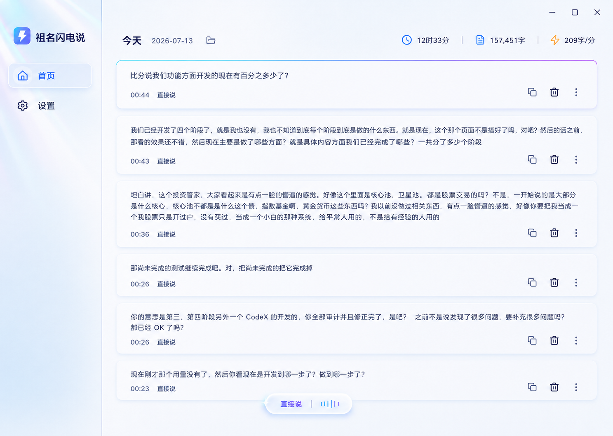

# 祖名闪电说 UI 设计规范

## 1. 设计方向

设计关键词：**日光未来感、光学玻璃、轻量科技、安静专业**。

界面以珍珠白和冰蓝为底，使用电光蓝、青色和柔紫色建立品牌识别。科技感来自细腻的光谱边缘、透明材质和精确排版，而不是深色赛博朋克、强烈霓虹或复杂仪表盘。

最终首页视觉稿是实现时的视觉基准：

## 2. 设计令牌

完整机器可读令牌见 [tokens.json](tokens.json)。

### 色彩

| 用途 | 色值 | 说明 |
| --- | --- | --- |
| 页面底色 | `#F7FAFF` | 珍珠白，允许叠加极淡冰蓝渐变 |
| 侧栏底色 | `#F0F6FF` | 与内容区保持轻微层次 |
| 内容表面 | `#FFFFFFE8` | 约 91% 白色，配合背景模糊 |
| 主品牌色 | `#3976FF` | 首页选中、主要数字、焦点状态 |
| 能量青 | `#34D9E6` | 声波、成功、光谱起点 |
| 光谱紫 | `#8D78FF` | 品牌渐变终点、强调状态 |
| 正文 | `#16223A` | 高对比深海军蓝，不使用纯黑 |
| 次级文字 | `#65728B` | 时间、模式、说明文字 |
| 边框 | `#DCE8F8` | 普通卡片 1 px 细边 |
| 错误 | `#E4546B` | 仅用于明确失败，不大面积铺色 |
| 成功 | `#27B88A` | 已复制、连接正常 |

### 字体

- Windows 中文：`Microsoft YaHei UI`，后备 `Segoe UI Variable`。
- 产品名：20 px / Semibold。
- 页面标题：24 px / Semibold。
- 正文：15 px / Regular，行高 1.7。
- 卡片元数据：13 px / Semibold。
- 统计数字：16 px / Semibold。

### 圆角、间距与阴影

- 页面栅格基础单位：4 px。
- 常用间距：8 / 12 / 16 / 20 / 24 / 32 px。
- 左侧栏宽度：240 px。
- 历史卡片圆角：16 px。
- 普通按钮圆角：10 px。
- 录音胶囊：204 × 58 px，圆角 29 px。
- 卡片阴影：`0 8 28`，颜色 `#4776B214`，只做轻微离地感。
- 玻璃胶囊阴影：外层蓝紫柔光 + 细白色内高光，不使用黑色投影。

## 3. 页面结构

### 3.1 首页

- 左侧仅保留品牌、首页和设置。
- 品牌区域显示闪电图形和完整名称“祖名闪电说”。
- 主内容顶部左侧显示“今天”、日期和打开录音文件夹图标。
- 顶部右侧显示累计时长、累计字数、平均语速。
- 历史记录按时间倒序，以独立卡片呈现。
- 每条卡片右下角固定为复制、删除、更多三个纯图标；文字只出现在 Tooltip。
- 最新卡片允许使用 1 px 青色到柔紫色的顶部光谱线，其他卡片保持克制。
- 删除后页面底部显示 5 秒撤销条。
- 滚动超过一个屏幕后，右下角显示 40 px 回到顶部按钮。

### 3.2 设置页

沿用首页侧栏和顶栏，不新建第二套视觉语言。内容宽度不超过 880 px，按以下分组纵向排列：

1. **语音识别服务**：阿里云、AppKey、AccessKey ID、Secret、测试连接。
2. **麦克风**：设备选择、实时音量测试、口语顺滑开关。
3. **快捷键**：主快捷键“右 Alt”；兼容模式下显示固定备用键 `Ctrl + Win + Space`。
4. **自动写入兼容性**：当前目标应用、最近一次写入方式、测试写入、兼容模式选择。
5. **本地数据**：录音目录、三天保留说明、打开目录。

Secret 默认遮挡，只提供短暂查看按钮；危险或敏感字段不得用品牌渐变强调。

### 3.3 记录详情

采用右侧 420 px 抽屉，不使用居中大弹窗。包含最终文本和复制按钮、开始时间、时长、引擎、状态、重试次数、音频播放器和重新转写。失败时显示用户可理解的原因，不显示 Secret、Token 或完整服务端报文。

### 3.4 更多菜单

- 菜单宽 168 px，圆角 12 px。
- 顺序固定：播放录音、重新转写、查看详情。
- 图标 18 px，文字 14 px。
- 使用纯白表面与极细蓝灰边框，不使用透明玻璃以保证可读性。

## 4. 录音胶囊

最终胶囊采用用户选定的紧凑玻璃方案：

- 胶囊不是主窗口里的组件，而是独立、置顶、不激活的 Windows 悬浮窗口。
- 空闲时完全隐藏；用户在任意页面或应用中按右 Alt 都会显示，不以是否存在输入框为前提。
- 主窗口最小化、关闭到托盘或被其他窗口遮挡时，胶囊仍显示在当前活动屏幕上。
- 204 × 58 px，位于当前屏幕底部居中，任务栏上方 12 px。
- 半透明乳白光学玻璃，带背景模糊和白色内高光。
- 左侧文字“直接说”为蓝紫色，右侧 5 根声波由青到紫渐变。
- 中间 1 px 淡蓝灰分隔线。
- 胶囊不能抢焦点，不能出现关闭按钮或计时。
- 胶囊不接受鼠标操作；用户继续通过右 Alt 结束、Esc 取消。

| 状态 | 左侧文案 | 右侧表现 | 持续时间 |
| --- | --- | --- | --- |
| 录音中 | 直接说 | 5 根音量柱随麦克风变化 | 直到用户结束 |
| 识别中 | 识别中 | 3 个柔和脉冲点 | 直到最终结果 |
| 已完成 | 已写入 | 青色对勾 | 400 ms 后消失 |
| 无输入目标 | 已保存 | 青色对勾 | 400 ms 后消失 |
| 写入受阻 | 未能写入 | 复制图标 | 2.5 秒后消失 |
| 识别失败 | 识别失败 | 红色细线警示图标 | 2.5 秒后消失 |

空闲状态不渲染胶囊，也不保留透明占位窗口。

“已保存”和“未能写入”必须严格区分：前者表示开始录音时没有可编辑输入目标，结果已正常进入历史；后者表示检测到了输入目标，但自动写入被安全软件或权限阻止。

## 5. 安全软件兼容反馈

当系统确认自动写入失败，胶囊上方显示一条不抢焦点的紧凑提示：

`未能自动写入 · 文字已复制    查看兼容性`

- 提示宽度不超过 360 px，高度 40 px。
- “查看兼容性”只在用户主动点击后打开设置页。
- 提示不得把焦点从用户当前应用切走。
- 无法可靠确认成功或失败时，使用“已复制，可直接粘贴”，不声称自动写入成功。

## 6. 动效

- 页面和卡片不使用持续循环动画。
- 胶囊进入：160 ms，轻微上移 8 px + 淡入。
- 胶囊状态切换：120 ms 交叉淡化，不改变外框尺寸。
- 声波：60 FPS 上限，使用音量平滑后的高度，不做随机跳动。
- 删除撤销条：180 ms 自下而上进入。
- 尊重 Windows“关闭动画”辅助设置；关闭后全部改为直接切换。

## 7. 图标与无障碍

- 使用同一套圆角线性图标，建议 `Segoe Fluent Icons` 或 Fluent System Icons。
- 图标视觉尺寸 18–20 px，可点击区域至少 36 × 36 px。
- 所有纯图标必须有 Tooltip 和自动化名称。
- 正文与底色对比度至少 4.5:1；装饰光晕不承担信息表达。
- 键盘焦点环使用 2 px 品牌蓝，不只依赖颜色变化。

## 8. 禁止项

- 不使用深色全屏赛博朋克主题。
- 不把每个指标做成独立大卡片。
- 不使用大面积彩虹渐变、强外发光或 3D 拟物按钮。
- 不在录音胶囊中加入时间、取消按钮或设置入口。
- 不因错误提示切换窗口焦点。
