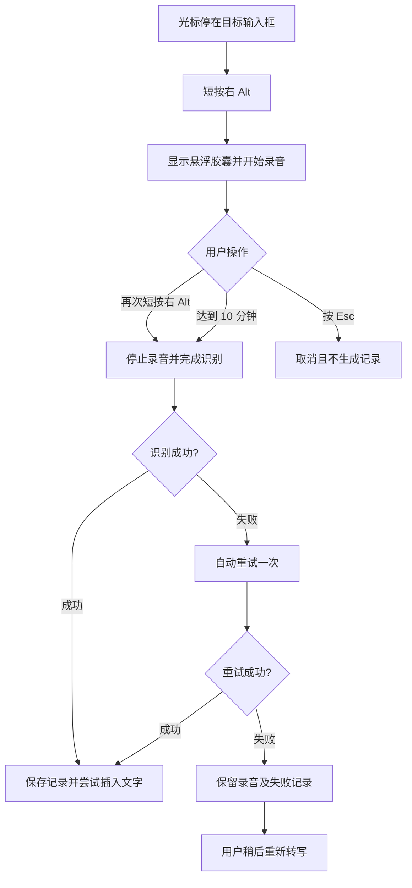
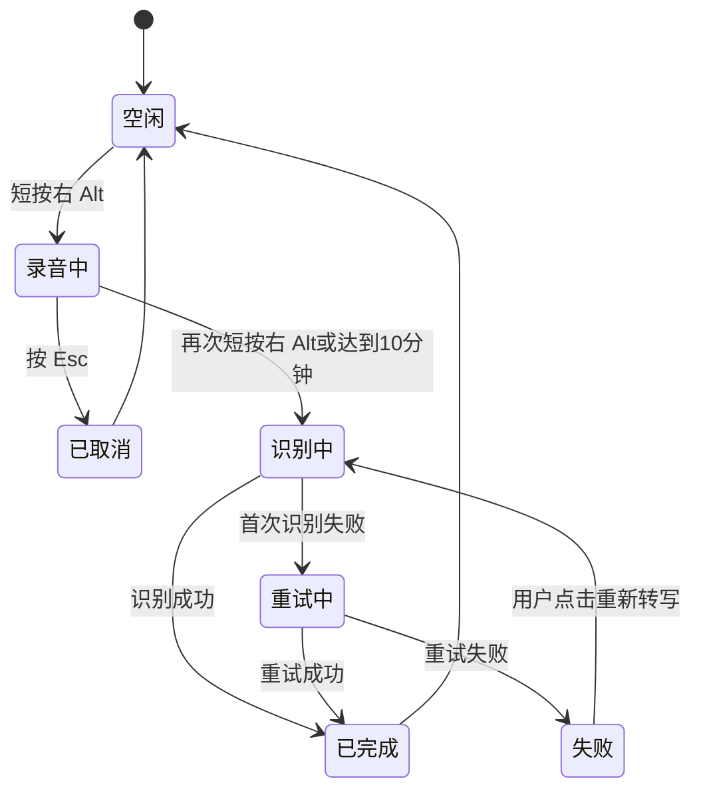

# 产品需求文档：祖名闪电说 - V1.0

## 1. 综述

### 1.1 项目背景与核心问题

用户当前使用按月付费的语音听写软件，在高强度开发场景中仍需额外购买用量。目标是开发一款 Windows 本地桌面工具，保留其最核心、最高频的体验：通过右 Alt 控制录音，使用用户自己的阿里云语音识别账号完成云端转录，把最终文本插入当前光标位置，并提供防丢失的历史记录。

V1 不使用本地 Whisper，不接入大语言模型，也不实现语义改写。文本整理仅使用阿里云语音识别提供的标点、数字格式化、语义断句和口语顺滑能力，避免摘要、扩写或改变原意。

### 1.2 产品目标

1. 光标停留在任意输入框时，短按右 Alt 开始录音。
2. 屏幕底部显示紧凑的“直接说”悬浮胶囊和动态声波。
3. 再次短按右 Alt，结束录音并完成阿里云实时语音识别。
4. 最终文本一次性插入原光标位置，不插入中间草稿。
5. 每次听写形成独立历史记录，支持复制、删除、播放录音、重新转写和查看详情。
6. 写入或识别失败时保留录音和记录，确保内容可恢复。

### 1.3 非目标

- 不实现长按 Alt 的大模型助手。
- 不实现资料库、技能、词典和常用回复。
- 不实现大模型润色、摘要、扩写或语义改写。
- 不实现本地语音识别模型。
- 第一轮不接入火山引擎，只预留识别服务适配接口。
- 第一轮不提供任意自定义热键和安装程序；安全软件阻止右 Alt 时可启用固定备用热键。

### 1.4 用户旅程地图

1. **初次配置**：填写阿里云凭证，选择麦克风并测试连接。
2. **开始听写**：将光标放到目标输入框，短按右 Alt 开始录音。
3. **结束识别**：再次短按右 Alt，停止录音并取得最终文本。
4. **写入与兜底**：尝试插入原光标位置，同时保存独立历史记录。
5. **记录管理**：复制、删除、播放、重新转写或查看详情。
6. **统计与清理**：长期保存累计统计，只保留最近三个自然日的详细记录和录音。

### 1.5 用户操作流



### 1.6 听写状态机



## 2. 用户故事详述

### 阶段一：配置识别服务

#### US-01：作为用户，我希望在界面中配置阿里云识别服务，以便使用自己的云端账号完成转录

**业务规则与逻辑**

1. 设置项包括 AppKey、AccessKey ID、AccessKey Secret 和麦克风。
2. Secret 使用 Windows 当前用户级加密保存，不以明文写入数据库、日志或崩溃信息。
3. 应用根据长期凭证自动获取和刷新临时 Token，用户无需手动维护 Token。
4. “测试连接与麦克风”同时验证凭证、服务可用性和麦克风是否收到声音。
5. 口语顺滑默认开启，允许用户关闭后重新转写。
6. 第一轮实际实现阿里云，底层保留火山引擎适配接口。

**异常处理**

- 字段缺失时阻止保存，并在字段下显示明确提示。
- 鉴权失败时只显示可理解的错误原因，不显示 Secret。
- 麦克风不可用时列出可选设备并引导重新测试。
- Token 过期时由应用自动刷新后重试一次。

**验收标准**

- **GIVEN** 用户输入有效的三项凭证并选择可用麦克风，**WHEN** 点击测试，**THEN** 显示连接成功且能反映麦克风音量。
- **GIVEN** Secret 已保存，**WHEN** 用户重启应用，**THEN** 应用能够正常鉴权且界面不显示完整 Secret。
- **GIVEN** 凭证无效，**WHEN** 用户测试连接，**THEN** 显示鉴权失败并允许修改，日志中不出现凭证明文。

**页面布局线框图**

```text
┌─ 设置 / 语音识别 ────────────────────────────────────┐
│ 服务商        [ 阿里云 ▾ ]                           │
│ AppKey        [ _________________________________ ]  │
│ AccessKey ID  [ _________________________________ ]  │
│ Secret        [ ••••••••••••••••••••••••••••••• ]  │
│                                                     │
│ 麦克风        [ 系统默认麦克风 ▾ ]                   │
│ 口语顺滑      [✓]                                    │
│                                                     │
│             [ 测试连接与麦克风 ]   [ 保存 ]          │
│ 状态：连接成功，已收到麦克风声音                      │
└─────────────────────────────────────────────────────┘
```

### 阶段二：开始与结束听写

#### US-02：作为高频输入用户，我希望用右 Alt 控制听写，以便不打断当前工作

**业务规则与逻辑**

1. 短按右 Alt 开始录音，再次短按右 Alt 结束并识别。
2. 应用拦截右 Alt，避免它同时触发当前应用菜单。
3. 录音时按 Esc 取消；取消后不写入、不生成记录。
4. 单次录音最长 10 分钟，达到上限后自动结束并识别。
5. 不根据静音自动结束，避免思考停顿时被打断。
6. 录音期间音频同时写入本地临时文件，网络中断也不丢录音。
7. 悬浮胶囊不抢焦点、不播放声音，也不显示计时和按钮。
8. 胶囊是独立于主窗口的置顶悬浮窗口；主程序最小化或收进系统托盘时仍可工作。
9. 空闲时胶囊完全隐藏，第一次短按右 Alt 才显示；识别完成、失败提示结束或取消后自动隐藏。
10. 听写不依赖输入框：用户在桌面、文件管理器或任何无输入光标的页面按右 Alt，也必须正常录音和识别。

**悬浮胶囊线框图**

```text
                ╭──────────────────────╮
录音中          │  直接说  │  ▁ ▃ ▆ ▂ ▁ │
                ╰──────────────────────╯

                ╭──────────────────────╮
识别中          │  识别中  │    • • •   │
                ╰──────────────────────╯
```

**视觉要求**

- 尺寸约 204×58 px，黑色背景、白色粗体文字、全圆角。
- 位于当前屏幕底部居中，距离任务栏约 8–16 px。
- 适配 Windows 100%、125% 和 150% 缩放。
- 声波由麦克风实时音量驱动；无声音时静止。
- 状态顺序为“直接说 → 识别中 → 消失”；失败时短暂显示“识别失败”。

**验收标准**

- **GIVEN** 光标位于任意普通输入框，**WHEN** 短按右 Alt，**THEN** 开始录音且目标输入框仍保持焦点。
- **GIVEN** 主窗口已最小化或收进托盘，**WHEN** 用户在其他应用短按右 Alt，**THEN** 胶囊在当前活动屏幕任务栏上方出现，主窗口不恢复也不抢焦点。
- **GIVEN** 当前没有可编辑输入框或插入光标，**WHEN** 用户完成听写，**THEN** 结果正常保存到历史并计入统计，胶囊显示“已保存”后消失，不尝试自动写入也不覆盖剪贴板。
- **GIVEN** 正在录音，**WHEN** 麦克风收到声音，**THEN** 胶囊声波实时变化。
- **GIVEN** 正在录音，**WHEN** 按 Esc，**THEN** 胶囊消失且不生成记录。
- **GIVEN** 已连续录音 10 分钟，**WHEN** 达到上限，**THEN** 自动停止并开始识别。

### 阶段三：云端识别与文本写入

#### US-03：作为用户，我希望说完后一次性获得整理过但不改语义的文本

**业务规则与逻辑**

1. 录音期间使用阿里云实时语音识别推送 16 kHz、16 bit、单声道 PCM。
2. 可以接收中间识别结果用于服务端断句，但不把中间结果写入输入框。
3. 结束后只保存和插入最终文本。
4. 开启标点、数字格式化、语义断句和口语顺滑。
5. 口语顺滑只使用阿里云 ASR 自带能力，不执行本地语义改写或大模型处理。
6. 识别失败后自动刷新 Token 并重试一次；仍失败则保存失败记录与录音。
7. 失败记录不计入字数统计，但录音时长计入总听写时长。

**自动写入规则**

1. 开始录音时记录原目标窗口、焦点控件、进程和完整性级别。
2. 根据目标控件能力选择原生编辑消息、标准粘贴消息或输入模拟，不允许只依赖模拟 `Ctrl+V`。
3. 写入前暂存旧剪贴板；能够验证成功时恢复旧内容，失败或无法验证时保留最终文本。
4. 不提升程序权限；无法写入管理员权限应用或被安全软件阻止时，显示“未能自动写入 · 文字已复制”。
5. 第三方输入框是否真正接收粘贴无法统一判断，因此历史记录始终是最终兜底。
6. 右 Alt 被安全软件拦截时，允许启用固定备用热键 `Ctrl + Win + Space`；V1 仍不提供任意自定义热键。
7. 目标分为“可编辑目标、无输入目标、目标已失效”三类。后两类直接保存历史，不属于写入失败。

**验收标准**

- **GIVEN** 阿里云连接正常，**WHEN** 用户结束听写，**THEN** 最终文本只插入一次且不出现中间草稿。
- **GIVEN** 用户重复说话或包含语气词，**WHEN** 口语顺滑开启，**THEN** 使用阿里云顺滑结果，但不摘要、扩写或改变原意。
- **GIVEN** 首次识别失败，**WHEN** 自动重试成功，**THEN** 正常保存和插入且重试次数记为 1。
- **GIVEN** 两次识别都失败，**WHEN** 流程结束，**THEN** 历史中保留失败记录和可重转录音。

### 阶段四：历史、复制与重新转写

#### US-04：作为用户，我希望每次听写独立保存，以便写入失败时能够快速恢复

**业务规则与逻辑**

1. 每次正常结束的听写形成一张独立记录卡。
2. 卡片正文显示最终文本，长文本自然换行并扩展卡片高度。
3. 左下角显示 `MM:SS + 直接说`。
4. 右下角依次显示复制、删除和更多三个纯图标。
5. 更多菜单包含播放录音、重新转写和查看详情。
6. 复制成功后图标短暂变为对勾，并显示“已复制”。
7. 删除立即从列表移除，并提供 5 秒撤销机会。
8. 重新转写复用原录音和当前设置，成功后更新最终文本。
9. 查看详情显示时间、时长、识别引擎、任务 ID、重试次数和状态。

**历史卡片线框图**

```text
今天                                                   [文件夹]

╭──────────────────────────────────────────────────────────────╮
│ 本次听写识别出的完整文字，长内容在卡片内自然换行……           │
│                                                              │
│ 00:59  直接说                                  [复制][删除][⋮]│
╰──────────────────────────────────────────────────────────────╯
```

**验收标准**

- **GIVEN** 自动写入失败，**WHEN** 用户点击卡片复制图标，**THEN** 最终文本进入系统剪贴板并显示成功反馈。
- **GIVEN** 用户点击删除，**WHEN** 5 秒内点击撤销，**THEN** 记录和录音恢复。
- **GIVEN** 记录仍保留录音，**WHEN** 用户点击播放，**THEN** 能听到该次原始声音。
- **GIVEN** 失败记录存在，**WHEN** 网络恢复后点击重新转写，**THEN** 成功结果更新到该记录。

### 阶段五：时间分组、统计与清理

#### US-05：作为用户，我希望快速浏览最近听写并了解累计使用情况

**业务规则与逻辑**

1. 记录按时间倒序排列，并按“今天、昨天、具体日期”分组。
2. 向下滚动一定距离后，右下角出现回到顶部按钮；点击后平滑回到顶部。
3. 详细文本和录音只保留今天、昨天、前天三个自然日。
4. 进入第四天时自动清理最早一天的详细记录和录音。
5. 总听写时长、总字数和平均语速长期累计保存，不随详细记录清理而减少。
6. 平均语速公式为：累计成功识别的有效字符数 ÷ 累计成功听写分钟数。
7. 顶部文件夹图标打开本地录音目录。

**验收标准**

- **GIVEN** 存在多天记录，**WHEN** 打开首页，**THEN** 记录按今天、昨天和日期正确分组并倒序显示。
- **GIVEN** 用户向下滚动超过一个屏幕，**WHEN** 点击回到顶部，**THEN** 页面平滑回到最新记录。
- **GIVEN** 应用进入第四个自然日，**WHEN** 执行清理，**THEN** 最早一天的文字和录音被删除，但累计统计保持不变。

## 3. 技术设计约束

### 3.1 目标平台与交付

- Windows 11 x64，单用户本机使用。
- 使用 .NET 10 LTS 和 WPF。
- Demo 发布为自包含 Windows x64 程序，目标电脑无需预装 .NET。
- 关闭主窗口后缩至系统托盘；开机启动默认关闭。

### 3.2 模块边界

```text
Desktop UI
├─ 首页与统计
├─ 历史卡片和详情
├─ 设置页
└─ 非激活悬浮胶囊

Application Services
├─ DictationCoordinator
├─ AudioRecorder
├─ GlobalHotkeyService
├─ TextInsertionService
├─ HistoryService
└─ RetentionService

Infrastructure
├─ AliyunAsrProvider
├─ SQLiteRepository
├─ WindowsCredentialProtection
├─ WindowsClipboard
└─ WindowsForegroundWindow
```

### 3.3 识别服务接口

```text
IAsrProvider
├─ TestConnectionAsync()
├─ StartSessionAsync()
├─ PushAudioAsync(pcmChunk)
├─ FinishSessionAsync()
├─ CancelSessionAsync()
└─ RetranscribeAsync(audioFile)
```

`AliyunAsrProvider` 是 V1 的实际实现。后续 `VolcengineAsrProvider` 必须复用同一接口，不修改录音、页面、历史或自动写入模块。

### 3.4 数据模型

```text
TranscriptionRecord
├─ Id
├─ Status: Recording / Recognizing / Completed / Failed / Cancelled
├─ StartedAt
├─ Duration
├─ FinalText
├─ AudioPath
├─ Provider
├─ ProviderTaskId
├─ RetryCount
└─ CharacterCount
```

本地使用 SQLite 保存记录、设置元数据、累计统计和状态；录音文件单独存放在应用数据目录。数据库不得保存 AccessKey Secret 明文。

## 4. 测试与验收清单

- 在记事本、浏览器输入框、VS Code、Codex 和常见聊天软件中验证右 Alt 启停和文本写入。
- 验证悬浮胶囊不抢焦点，并在 100%、125%、150% 缩放下保持底部居中。
- 验证有声音时波形变化、无声音时静止。
- 验证结束录音后只插入一次最终文本。
- 验证 Esc 取消不生成记录，10 分钟达到上限后自动结束识别。
- 验证断网、Token 过期、鉴权错误和超时均保留录音，且自动重试不超过一次。
- 验证自动写入失败时仍可从历史复制。
- 分别在 360 开启和关闭状态下验证记事本、VS Code、Codex、Chrome/Edge、微信或飞书；失败时必须降级为“文字已复制”且不得丢记录。
- 验证原生 Edit/RichEdit 优先使用直接插入，其他控件按兼容策略选择写入方式，且不得重复插入。
- 验证播放、重新转写、查看详情、删除和撤销删除。
- 验证第四个自然日清理详细记录后累计统计不减少。
- 验证凭证不出现在数据库明文、日志、崩溃信息或界面状态文本中。

## 5. 交付计划

### Demo 交付物

- 完整源代码。
- 自包含 Windows x64 可运行程序。
- 阿里云账号、项目与凭证配置说明。
- 基础自动化测试与人工验收记录。

### 后续版本候选

- 火山引擎适配器。
- 自定义热键。
- 词典与热词管理。
- 安装程序和自动更新。
- 长按 Alt 与大模型润色功能。

## 6. 已确认默认值

- 首个识别引擎：阿里云。
- 识别模式：实时流式，结束后一次性写入最终文本。
- 口语顺滑：默认开启，可关闭。
- 录音提示：只有紧凑悬浮胶囊，无提示音。
- 取消方式：录音中按 Esc。
- 安全软件兼容：分层写入；固定备用热键 `Ctrl + Win + Space`；失败时保留文字到剪贴板和历史。
- 单次录音上限：10 分钟。
- 失败重试：自动重试一次。
- 详细记录保留：三个自然日。
- 累计统计保留：长期保留。
- 数据范围：全部仅保存在本机，云端音频只发送到用户配置的阿里云识别服务。
