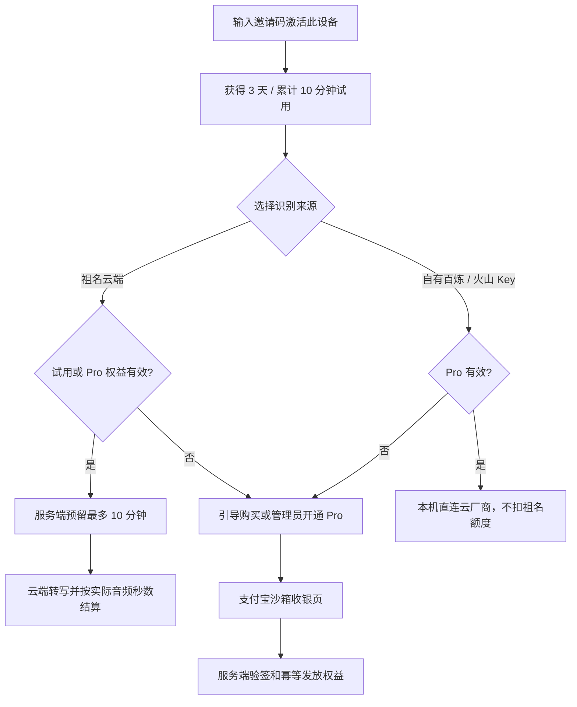
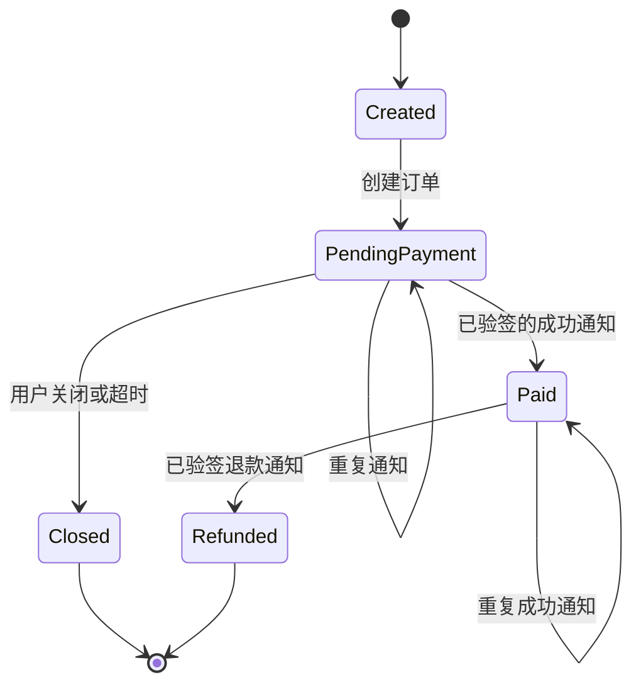

# 产品需求文档：祖名闪电说 - 商业化 V0.7

## 1. 目的与发布边界

本 PRD 定义祖名闪电说从“单用户、自带百炼 Key 的本地听写工具”演进为可内测、可计费的 Windows 产品的第一阶段。开发必须从独立分支 `codex/v0.7-commercial-foundation` 继续，不能改写、替换或重新发布用户正在使用的 v0.6.4 自用包。

V0.7 仍以“右 Alt 开始/结束、最终文字一次性写入、历史可复制兜底”为核心体验。现有记事本、Codex、微信及 360 开启时的写入兼容逻辑是回归保护对象，不因商业化重构而降级。

### 1.1 本期目标

1. 用户用邀请码激活一台设备，并取得受保护的设备凭证。
2. 普通用户只看见“祖名云端识别”：试用、Pro 月额度和加量包均由服务端权威账本控制。
3. Pro 用户可在“高级 / 自有模型”中配置自己的百炼或火山 Key；本机直连厂商，厂商费用由用户承担，不扣祖名云端额度。
4. 完成支付宝沙箱的下单、验签、异步通知、幂等发放权益和退款状态学习闭环。
5. 在不记录音频和转写正文的前提下，为祖名云端 ASR 提供 WebSocket 中转、秒级计量和成本标定数据。

### 1.2 本期不做

- 不做长按 Alt、AI 助手、Agent、资料库、风格、词典、技能、常用回复或公开推荐返佣。
- 不做邮箱/手机号/微信登录；内测仅支持邀请码绑定设备。
- 不接微信支付生产能力；只预留与支付宝共用的订单接口。
- 不承诺正式售价。页面可以标注“内测建议价 20 元 / 30 天”，正式定价必须在生产同规格账号累计 10 小时成本标定后确认。
- 不修改用户 D 盘已经可用的 v0.6.4 程序、安装包、热键或现有本地百炼配置。

## 2. 用户旅程与产品规则



### 2.1 权益和扣费规则

| 类型 | 有效期 | 可用时长 | 扣减规则 |
| --- | --- | --- | --- |
| 试用 | 激活后 3 天 | 累计 600 秒祖名云端 | 达到 600 秒或过期即不可再用祖名云端 |
| Pro | 30 天 | 每期 36,000 秒祖名云端 | 当前有效期月度桶优先 |
| 加量包 | 内测阶段不失效 | 每包 36,000 秒祖名云端 | 仅在当前月度桶不足后扣减 |
| 自有模型 | 仅有效 Pro | 不适用 | 不扣祖名云端额度，云厂商直接向用户计费 |

1. 祖名云端每次会话先预留最多 600 秒，成功时只按实际已发送 PCM 音频秒数结算。
2. 用户取消、两次识别都失败或服务端未建立转写会话时，释放可计费额度；服务端仍可保留不含音频/文本的成本事件。
3. 结算顺序严格为：当前有效月度桶 → 不失效加量包。不得先扣加量包。
4. 账本、订单和权益只以服务端 PostgreSQL 为准；客户端 SQLite 仅保存本地历史、录音、界面缓存和 DPAPI 加密的自有 Key。
5. 邀请码只能激活一台设备。管理员重置绑定后，原设备令牌立刻失效，邀请码或新邀请码才能绑定新设备。

### 2.2 账户与额度页面线框

```text
┌ 祖名闪电说 ────────────────────────────────────────────────┐
│ 首页   设置   订阅与额度   帮助与反馈                 [头像 ▾] │
├────────────────────────────────────────────────────────────┤
│ 订阅与额度                                                    │
│ 祖名云端识别 · Pro（剩余 18 天）                              │
│ [██████████░░░░░░░░]  4.2 / 10 小时                          │
│ 本期额度优先消耗，随后使用加量包                              │
│                                                               │
│ 加量包（不失效）                                               │
│ [████████░░░░░░░░░░]  6.8 / 10 小时      [购买加量包]         │
│                                                               │
│ [管理订阅]     [查看套餐]                                     │
└────────────────────────────────────────────────────────────┘
```

普通用户的设置只展示“祖名云端识别”。“高级 / 自有模型”折叠在设置中，只有有效 Pro 才可编辑百炼/火山凭证；无 Pro 时展示权益说明与进入订阅页按钮，不展示或索取 Key。

## 3. 状态机



订单权益只能由服务端从 `PendingPayment` 首次转为 `Paid` 时发放；重复通知、浏览器返回页和客户端轮询都不得重复增加 Pro 天数或加量包秒数。退款将订单状态更新为 `Refunded`，但是否回收已消耗权益必须由管理员显式处理，不能由客户端自动回滚。

## 4. 架构与数据边界

```text
WPF Windows 客户端
  ├─ 现有热键、录音、悬浮胶囊、分层自动写入、本地历史/音频
  ├─ 自有百炼 / 火山 Key：DPAPI 加密，本机直连厂商
  └─ 祖名云端：HTTPS + WSS → Zumingtalk.Service

Zumingtalk.Service（ASP.NET Core 10）
  ├─ PostgreSQL：设备、权益、额度桶、账本、订单、支付通知、审计元数据
  ├─ 祖名云端 WSS 中转：服务端百炼主 Key，不落盘音频和转写正文
  ├─ 管理 API：邀请码、重置设备、手动开通 Pro、手动发放加量包
  └─ 支付：支付宝沙箱下单、签名验签、异步通知、退款状态
```

### 4.1 新增项目与职责

```text
src/Zumingtalk.Service/             ASP.NET Core 10 服务端
src/Zumingtalk.Service/Commerce/    激活、权益、额度、账本、管理操作
src/Zumingtalk.Service/Asr/         云端会话鉴权与百炼 WebSocket 中转
src/Zumingtalk.Service/Payments/    支付宝沙箱订单、验签、通知、退款状态
src/Zumingtalk.Service/Data/        PostgreSQL 迁移和仓储
tests/Zumingtalk.ServiceTests/      额度、订单幂等、支付验签、API 集成测试
docker-compose.yml                  仅本地开发 PostgreSQL，不提交密码
```

不得把服务端主 Key、支付宝私钥、数据库密码、用户自有 Key、音频或转写正文提交到 Git、写入日志或写入异常详情。

### 4.2 PostgreSQL 最小表

| 表 | 关键字段 | 数据约束 |
| --- | --- | --- |
| `invite_codes` | `code_hash`, `status`, `activated_device_id` | 原始邀请码只在创建时显示一次；哈希唯一 |
| `device_activations` | `id`, `device_fingerprint_hash`, `token_hash`, `revoked_at` | 单设备指纹唯一；令牌只存哈希 |
| `entitlements` | `activation_id`, `plan`, `starts_at`, `ends_at` | 当前有效 Pro 由服务端时间判断 |
| `quota_buckets` | `kind`, `remaining_seconds`, `expires_at` | 月度桶可过期；加量包 `expires_at` 为 NULL |
| `usage_ledger` | `session_id`, `source`, `seconds`, `outcome` | 不含音频路径和文字；`session_id` 唯一防重复结算 |
| `orders` | `order_no`, `activation_id`, `product_id`, `amount_fen`, `status` | `order_no` 唯一；金额只由服务端商品表生成 |
| `payment_notifications` | `provider`, `provider_notification_id`, `verified_at` | 通知 ID 唯一，原始回调仅保存必要字段/签名状态 |
| `admin_audit_logs` | `actor`, `action`, `target_id`, `metadata` | 不写 Secret、音频或转写正文 |

## 5. 服务端接口契约

所有设备接口以 `Authorization: Bearer <device-token>` 鉴权；令牌轮换、失效和管理员重置必须立即生效。管理员接口仅可由独立后台身份调用，不能把管理员 Key 置于 WPF 客户端或前端资源中。

| 接口 | 用途 | 必须行为 |
| --- | --- | --- |
| `POST /api/activation` | 邀请码激活设备 | 一次性返回设备令牌；重复设备绑定明确拒绝 |
| `GET /api/me/entitlement` | 获取权益与额度 | 返回试用/Pro、各桶剩余秒数、服务端时间 |
| `POST /api/asr/sessions` | 创建祖名云端会话 | 校验权益，最多预留 600 秒，返回会话 ID |
| `GET /api/asr/stream` (WSS) | PCM / 识别事件中转 | 不落盘、不记录正文；仅已预留会话可接入 |
| `POST /api/asr/sessions/{id}/finish` | 服务端结算 | 服务端按实际接收音频秒数结算；客户端不可上传扣费秒数 |
| `POST /api/orders` | 创建支付订单 | 商品、金额由服务端白名单决定；返回托管收银 URL |
| `POST /api/payments/alipay/notify` | 支付宝异步通知 | 验签、金额/商户订单核对、通知幂等、再发权益 |
| `POST /api/admin/invites` | 创建邀请码 | 仅后台；只返回一次明文邀请码 |
| `POST /api/admin/devices/{id}/pro` | 手动开通 Pro | 记录审计日志 |
| `POST /api/admin/devices/{id}/add-on` | 手动发放加量包 | 固定 36,000 秒，记录审计日志 |
| `POST /api/admin/devices/{id}/reset` | 解除设备绑定 | 吊销令牌并记录审计日志 |

## 6. 用户故事与验收

### US-201 邀请码激活与设备绑定

作为内测用户，我希望用邀请码激活当前电脑，以便取得试用或已发放权益。

- 输入有效邀请码和本机匿名设备指纹后，服务端创建绑定并仅返回一次设备令牌。
- 同一个邀请码、同一个设备指纹或已重置令牌的异常状态必须有清楚提示；不得生成多个有效绑定。
- 管理员重置后，旧令牌访问任意设备接口必须失败。

**验收：** 一个邀请码只能成功绑定一台设备；管理员重置后新电脑可以重新激活；数据库中没有明文邀请码或设备令牌。

### US-202 祖名云端试用、Pro 和加量包

作为用户，我希望清楚看到可用时长，并按月度额度优先消耗。

- 试用为激活后 3 天内累计 600 秒。
- Pro 每期得到 36,000 秒；加量包每包 36,000 秒且内测不失效。
- 每次成功会话只从月度桶先扣实际秒数，不足部分才扣加量包。

**验收：** 用 36,000 秒月度桶、36,000 秒加量桶模拟 36,010 秒已结算音频时，月度桶为 0、加量桶为 35,990；取消与两次失败不会降低可用额度。

### US-203 祖名云端 ASR 中转

作为普通用户，我希望无需配置模型 Key 即可使用听写。

- WPF 录制的 16 kHz / 16 bit / 单声道 PCM 通过服务端 WSS 中转至百炼实时 ASR。
- 服务端仅保留会话 ID、来源、开始/结束时间、音频秒数、结果状态和成本标签；禁止持久化音频二进制和转写正文。
- 现有悬浮胶囊、热键、历史记录、自动写入和复制兜底仍由 WPF 执行。

**验收：** 服务端日志和数据库抽样检索不到音频、原始识别文本和百炼主 Key；断网、令牌失效、超时均能保留本地录音和历史记录。

### US-204 自有模型

作为 Pro 用户，我希望使用自己的百炼或火山 Key，以便自行承担厂商费用。

- 仅有效 Pro 可编辑并使用自有 Key；过期后保留加密配置但停止调用并引导续订。
- 百炼和火山各实现一个真实适配器；不可用时明确显示来源错误，不伪造“已连接”。
- 自有来源会话不创建祖名云端额度预留，也不写入云端使用账本。

**验收：** Pro 有效时自有百炼/火山均能完成连接测试；Pro 过期时无法开始自有模型会话；使用自有模型前后祖名云端额度完全不变。

### US-205 支付宝沙箱

作为测试人员，我希望完成购买、关闭支付、重复回调、验签失败和退款状态的端到端测试。

- 产品仅允许 `pro_month` 和 `add_on_10h`；金额从服务端配置读取，客户端传入金额无效。
- 桌面端创建订单后只打开支付宝托管收银 URL；客户端跳转返回不能直接发权益。
- 异步通知必须使用支付宝公钥验签，核对 `out_trade_no`、金额、App ID 和交易状态，再以数据库事务完成订单与权益更新。

**验收：** 成功、取消、重复成功通知、伪造签名、金额不一致、退款通知均有自动化测试；同一成功通知执行两次，权益只增加一次。

### US-206 帮助、反馈与账户菜单

作为用户，我希望了解额度、写入兼容性与反馈方式。

- 账户菜单含订阅与额度、帮助与反馈、退出/解除本机激活（若允许）等入口。
- FAQ 说明 360/管理员窗口的兼容边界、复制兜底、额度规则、自有 Key 计费归属及隐私边界。
- “反馈”调用用户配置的支持邮箱；正文默认附版本、匿名设备 ID 和用户明确勾选的诊断信息，绝不附听写内容或录音。

**验收：** 反馈邮件草稿不含转写正文、音频路径、API Key、设备令牌或支付信息；未勾选诊断信息时只带用户文本和版本号。

## 7. 开发顺序、质量门与成本标定

1. **M1 商业化基础**：服务端骨架、Docker PostgreSQL、迁移、邀请码、设备令牌、管理员权益和审计。
2. **M2 额度与祖名云端**：账本事务、WSS ASR 中转、桌面云端来源、订阅/额度页。
3. **M3 多模型和设置**：保留现有百炼自有 Key，新增火山自有 Key，重整设置页，帮助与反馈。
4. **M4 支付学习闭环**：支付宝沙箱订单、验签通知、幂等、退款状态、助理测试脚本。
5. **M5 成本与发布准备**：连续累计 10 小时真实 ASR，记录音频秒数、百炼账单、服务中转、存储、支付和支持成本，再决定正式售价、微信支付、安装包和上线。

每个里程碑完成后都必须：运行 Release build 和全部测试；审查 git diff；记录真实测试证据；不以 Mock 冒充真人/真实支付/真实 ASR 验收。

百炼实时 ASR 的计量与模型可用性以官方控制台及官方文档为准，不能在代码中写死单价。[百炼用量说明](https://help.aliyun.com/zh/model-studio/model-usage-statistics) [百炼实时 ASR 模型](https://help.aliyun.com/zh/model-studio/asr-model)
